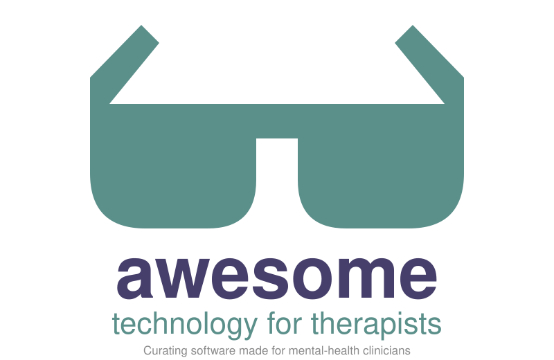

**Software made for psychotherapists, counselors, social workers, psychologists and other mental-health clinicians.**  
Open source & proprietary — practice management, AI notes, measurement, insurance, licensure hours, directories and more.

  
  
  
  
  

> **What is this?** A directory of software built for therapy practice. Each entry uses the vendor's own description; the icons record what the vendor states about protecting client information.
>
> *Know a tool that's missing or have a correction to make?* [Open a PR](CONTRIBUTING.md).

## Legend

| Icon | Meaning                                                     |
| ---- | ----------------------------------------------------------- |
| 🤝   | Business Associate Agreement (BAA) offered, per the vendor. |
| 🏠   | Self-hostable.                                              |
| 🛡️  | SOC 2 or HITRUST certified, per the vendor.                 |
| ✨    | AI features (notes, matching, assistants).                  |
| 🧪   | Early stage: pre-launch, beta, or few users.                |

## Contents

- [Practice Management](#practice-management)
- [Open-Source Practice Management](#open-source-practice-management)
- [AI Notes](#ai-notes)
- [Measurement-Based Care](#measurement-based-care)
- [Dictation](#dictation)
- [Insurance Networks and Billing](#insurance-networks-and-billing)
- [Clearinghouses](#clearinghouses)
- [Payments](#payments)
- [Intake and Matching](#intake-and-matching)
- [Licensure Hours and CEUs](#licensure-hours-and-ceus)
- [Directories](#directories)
- [Websites](#websites)
- [Clinical Resources](#clinical-resources)
- [Comparisons](#comparisons)
- [Related Lists](#related-lists)

## Practice Management

- 🤝✨ [ICANotes](https://www.icanotes.com/) - Behavioral health EHR and EMR for mental health clinicians, not adapted from a general medical platform.
- 🤝 [Owl Practice](https://owlpracticesuite.com/) - Therapy practice management, taking the complexity out of mental health care.
- ✨ [Sessions Health](https://www.sessionshealth.com/) - All-in-one HIPAA-compliant EHR for scheduling, notes, billing, telehealth, and client care.
- 🤝🛡️✨ [SimplePractice](https://www.simplepractice.com/) - HIPAA-compliant EHR and practice management software for therapists, health and wellness professionals.
- 🛡️✨ [TheraNest](https://ensorahealth.com/product/theranest-mental-health/) - Mental health practice management from Ensora Health.
- ✨ [TheraPlatform](https://www.theraplatform.com/) - Practice management, EHR/EMR and teletherapy platform for therapists, counselors and psychologists.
- 🤝✨ [TherapyAppointment](https://therapyappointment.com/) - All-in-one EMR for mental health practitioners, built by a therapist.
- 🤝🛡️✨ [TherapyNotes](https://www.therapynotes.com/) - Behavioral health practice management and EHR, with TherapyFuel AI tools.
- 🛡️✨ [Valant](https://www.valant.io/) - Behavioral health EHR for therapy clinicians, prescribers and group practices.

[back to top](#contents)

## Open-Source Practice Management

- 🏠✨🧪 [limn-os](https://limn.dev) - EMR for solo mental health practice. Free to self-host; a paid client portal is sold separately. `License to be announced`
- 🏠 [My Practice](https://github.com/dholbach/my-practice) - Self-hosted practice management software for therapy, coaching, and similar work. `AGPL-3.0` `Python`
- 🏠✨🧪 [Synari EHR](https://github.com/gheetdufa/synari-ehr) - Open-source practice management for therapists, a self-hostable alternative to SimplePractice. `AGPL-3.0`

[back to top](#contents)

## AI Notes

- 🤝✨ [AutoNotes](https://www.autonotes.ai/) - AI progress notes for therapists and social workers.
- 🤝🛡️✨ [Blueprint](https://www.blueprint.ai/) - AI assistant for therapists covering documentation, admin, and clinical care, alongside your current EHR or within its own.
- 🤝🛡️✨ [Eleos](https://eleos.health/) - AI platform for community-based behavioral health organizations.
- 🤝🛡️✨ [Mentalyc](https://www.mentalyc.com/) - AI platform for therapists that drafts clinical notes, treatment plans, progress tracking, and session insights.
- ✨ [Pocket](https://heypocket.com/) - Small AI device that turns everything you say and hear into clear notes, action items, and search. A general recorder advertised to therapists; no BAA found on its site.
- 🤝✨ [Supanote](https://www.supanote.ai/) - HIPAA-compliant AI therapy notes with SOAP, DAP, and custom templates.
- 🤝🛡️✨ [Twofold](https://www.trytwofold.com/solutions/therapy-ai-note-taker) - AI scribe that generates clinical notes in seconds. Serves many specialties, with a therapy note taker.
- 🤝🛡️✨ [Upheal](https://www.upheal.io/) - AI therapy notes, scheduling and billing, designed for mental health providers and built by clinicians.

[back to top](#contents)

## Measurement-Based Care

- 🛡️ [Greenspace](https://greenspacehealth.com/en-us/providers/) - Mental health measurement-based care, with screening tools and outcome measures.
- 🤝✨ [NovoPsych](https://www.novopsych.com/) - Evidence-based psychological assessments and an AI scribe for behavioral health professionals.

[back to top](#contents)

## Dictation

Voice-to-text tools need not be built for therapists to be listed here; any clinician-grade dictation tool qualifies.

- 🛡️✨ [Augnito](https://augnito.ai/) - Voice AI for clinical documentation, including radiology.
- 🛡️ [Dragon Medical One](https://www.microsoft.com/en-us/health-solutions/clinical-workflow/dragon-medical-one) - The number one clinical documentation companion. Cloud speech recognition from Microsoft, working inside major EHRs.
- [Dragon Professional](https://dragon.nuance.com/en-us/dragon-professional) - Desktop dictation for document-heavy work; speech is recognized on your Windows computer.
- 🏠✨🧪 [SovereignBoard](https://github.com/jc-hackett/sovereignboard) - Android keyboard with a dictation key and optional AI cleanup. Speech is transcribed on your own server, not a vendor's. Built on HeliBoard. `GPL-3.0` `Kotlin`
- [Fluency Direct](https://www.solventum.com/en-us/home/health-information-technology/solutions/fluency-direct/) - Medical voice recognition for creating, editing and signing notes directly in the EHR. From Solventum, formerly 3M M*Modal.
- 🤝🛡️✨ [Heidi Dictate](https://www.heidihealth.com/en-us/solutions/hipaa-compliant-dictation-software) - Free HIPAA-compliant dictation software for clinicians.
- 🏠 [MacWhisper](https://macwhisper.com/) - Transcribes audio, meetings and dictation locally on your Mac.
- 🤝🏠 [OpenWhispr](https://openwhispr.com/) - Dictation app that runs locally or in the cloud; your voice is 3x faster than your keyboard. `MIT`
- [Philips SpeechLive](https://www.speechlive.com/us/) - All-in-one dictation and transcription for legal and healthcare.
- 🛡️✨ [Pocket Scribe](https://www.mypocketscribe.com/) - The AI solution for medical note dictation. Built for medical clinicians, including psychiatry.
- 🤝🛡️✨ [Suki](https://www.suki.ai/dictation/) - Clinical dictation and AI assistant for clinicians and health systems.
- 🤝🛡️🏠 [Superwhisper](https://superwhisper.com/) - Turn your voice into polished text, with on-device models.
- 🤝🛡️ [Wispr Flow](https://wisprflow.ai/) - Voice dictation for any app, with a HIPAA mode and a BAA individuals can sign in the app.

[back to top](#contents)

## Insurance Networks and Billing

Networks credential you and bill insurers under their own contracts; they are not clearinghouses.

- 🤝 [Alma](https://helloalma.com/for-providers/) - Premium solutions for clinical efficiency and practice growth. Insurance network for therapists, with a monthly membership.
- [Grow Therapy](https://growtherapy.com/providers/) - Insurance network for therapists, with free credentialing and weekly pay.
- [Headway](https://headway.co/for-providers) - Your practice, powered by Headway. Insurance network for therapists and psychiatric prescribers, free to join.
- [Rula](https://www.rula.com/provider-sign-up/) - Insurance network for mental health providers, free to join.
- [SonderMind](https://www.sondermind.com/join-sondermind/) - Professional therapy covered by insurance. Network for therapists.
- [TheraThink](https://therathink.com/) - Mental health insurance billing service for therapists and psychiatrists.

[back to top](#contents)

## Clearinghouses

Not built for therapists; they carry claims for every kind of practice. Listed because an insurance-billing practice needs one.

- 🤝🛡️ [Availity](https://www.availity.com/) - Healthcare network for claims and eligibility; free for payers that sponsor it.
- 🛡️ [Claim.MD](https://www.claim.md/) - EDI clearinghouse for claims, remittances and eligibility.
- 🤝 [Eligible](https://eligible.com/) - Insurance billing APIs for healthcare businesses.
- 🛡️ [Inovalon Provider Cloud](https://www.inovalon.com/) - Clearinghouse and revenue tools, formerly ABILITY Network.
- 🤝🛡️ [Office Ally](https://cms.officeally.com/clearinghouse) - Medical clearinghouse; free claims to participating payers.
- [Optum EDI Network](https://business.optum.com/en/operations-technology/network-connectivity/medical/edi.html) - Payer network for exchanging claims, formerly Change Healthcare. Hit by a 2024 ransomware attack that HHS calls the largest health-care breach in U.S. history.
- 🛡️ [pVerify](https://pverify.com/) - Real-time insurance eligibility verification. Checks coverage; does not send claims.
- 🤝🛡️ [Stedi](https://www.stedi.com/) - Headless clearinghouse with APIs for developers building billing software.
- 🛡️ [TriZetto Provider Solutions](https://www.trizettoprovider.com/) - Clearinghouse and revenue cycle management, part of Cognizant.
- 🤝🛡️ [Waystar](https://www.waystar.com/) - Healthcare revenue cycle management and payments.

[back to top](#contents)

## Payments

- 🤝 [Ivy Pay](https://www.talktoivy.com/ivypay) - Instant pay for therapists, charging a client's card on file.

[back to top](#contents)

## Intake and Matching

- ✨ [Breksey](https://breksey.com/) - Operations for therapy practices: inquiries, intake conversion, and client matching.

[back to top](#contents)

## Licensure Hours and CEUs

- 🧪 [Confirm](https://confirmmyhours.com/) - Tracks supervised hours toward LMFT, LPCC and LCSW licensure and CE renewals in all 50 states.
- [License Trail](https://www.licensetrail.com/) - Log clinical hours, verify them against your state's board requirements, and export board-ready reports.
- [Time2Track](https://time2track.com/) - Track, verify, and manage experiences for clinical training and internships.
- [Track Your Hours](https://www.trackyourhours.com/) - Track hours for BBS licensure as an LMFT, LCSW or LPCC.

[back to top](#contents)

## Directories

- [Inclusive Therapists](https://www.inclusivetherapists.com/) - Directory of verified mental health providers centering BIPOC, LGBTQ+, and people with marginalized identities.
- ✨ [MyWellbeing](https://www.mywellbeing.com/) - Matches clients with a therapist or coach.
- [Open Path Collective](https://openpathcollective.org/open-path-therapists/) - Affordable therapy you can count on. Sliding-scale directory; clinicians join free and charge $40–70 a session.
- [Psychology Today](https://www.psychologytoday.com/us/therapists) - Directory of therapists, psychologists and counselors, searchable by location, specialty and insurance.
- [Therapy for Black Girls](https://providers.therapyforblackgirls.com/) - Directory for finding a therapist for Black women and girls.
- [TherapyDen](https://www.therapyden.com/) - Inclusive directory of mental health professionals.
- [Zencare](https://zencare.co/) - Vetted therapist directory, searchable by specialty, availability, and insurance.

State by state: see [State Therapist Directories](State%20Therapist%20Directories.md), covering all 50 states and DC.

[back to top](#contents)

## Websites

- ✨ [Brighter Vision](https://www.brightervision.com/) - Custom websites and marketing for therapists. HIPAA email add-on runs through Hushmail.

[back to top](#contents)

## Clinical Resources

- [Therapist Aid](https://www.therapistaid.com/) - Worksheets, treatment guides, and videos for mental health professionals.

[back to top](#contents)

## Comparisons

`Unverified` means the vendor's own pages did not say. Sources for every cell are in [standards.md](standards.md).

### Practice Management

| Tool                                                                   | BAA            | Trains on your data | Self-host | Certification            | Cloud            |
| ---------------------------------------------------------------------- | -------------- | ------------------- | --------- | ------------------------ | ---------------- |
| [limn-os](https://limn.dev)                                            | You host       | No                  | Yes       | —                        | Yours            |
| [My Practice](https://github.com/dholbach/my-practice)                 | You host       | No AI               | Yes       | —                        | Yours            |
| [Owl Practice](https://owlpracticesuite.com/)                          | Listed on site | Unverified          | —         | —                        | Unverified       |
| [Sessions Health](https://www.sessionshealth.com/)                     | Unverified     | Unverified          | —         | SOC 2, HITRUST (claimed) | U.S. servers     |
| [SimplePractice](https://www.simplepractice.com/)                      | Self-serve     | No                  | —         | HITRUST                  | AWS (AI feature) |
| [Synari EHR](https://github.com/gheetdufa/synari-ehr)                  | You host       | Your AI provider    | Yes       | —                        | Yours            |
| [TheraNest](https://ensorahealth.com/product/theranest-mental-health/) | Unverified     | Unverified          | —         | HITRUST e1               | AWS              |
| [TheraPlatform](https://www.theraplatform.com/)                        | Unverified     | Unverified          | —         | —                        | Unverified       |
| [ICANotes](https://www.icanotes.com/)                                  | Offered        | Unverified          | —         | —                        | Unverified       |
| [TherapyAppointment](https://therapyappointment.com/)                  | Executed BAA   | No plans to         | —         | —                        | Unverified       |
| [TherapyNotes](https://www.therapynotes.com/)                          | Self-serve     | No                  | —         | HITRUST                  | Unverified       |
| [Valant](https://www.valant.io/)                                       | Unverified     | Not without consent | —         | HITRUST i1               | Unverified       |

### AI Notes

| Tool                                   | BAA                 | Trains on your data   | Session audio                  | Certification       | Cloud                  |
| -------------------------------------- | ------------------- | --------------------- | ------------------------------ | ------------------- | ---------------------- |
| [AutoNotes](https://www.autonotes.ai/) | Yes                 | Unverified            | Unverified                     | SOC 2 (unconfirmed) | Unverified             |
| [Blueprint](https://www.blueprint.ai/) | In terms of service | De-identified (terms) | Unverified                     | SOC 2               | U.S., provider unnamed |
| [Eleos](https://eleos.health/)         | Yes                 | De-identified audio   | De-identified copy may be kept | SOC 2, HITRUST      | AWS                    |
| [Mentalyc](https://www.mentalyc.com/)  | Self-serve          | No                    | Deleted once the note is ready | SOC 2               | AWS                    |
| [Supanote](https://www.supanote.ai/)   | Yes                 | Unverified            | Deleted after scribing         | —                   | Unverified             |
| [Twofold](https://www.trytwofold.com/) | Every plan          | No                    | Raw audio not stored           | HITRUST             | Unverified             |
| [Upheal](https://www.upheal.io/)       | Self-serve          | Opt-in only           | Unverified                     | SOC 2               | AWS                    |

### Measurement-Based Care

| Tool                                                       | BAA          | Trains on your data | Certification | Price for one clinician |
| ---------------------------------------------------------- | ------------ | ------------------- | ------------- | ----------------------- |
| [Greenspace](https://greenspacehealth.com/en-us/providers/) | Unverified  | No AI               | SOC 2 Type II | $24.99–39.99/month      |
| [NovoPsych](https://www.novopsych.com/)                    | In the terms | No                  | —             | Free plan; Pro paid     |

### Dictation

| Tool                                                                        | BAA                     | Trains on your data            | Where speech is processed     | Certification          | Price for one clinician     |
| --------------------------------------------------------------------------- | ----------------------- | ------------------------------ | ----------------------------- | ---------------------- | --------------------------- |
| [Augnito](https://augnito.ai/)                                              | Not found               | Unverified                     | Vendor cloud                  | SOC 2, ISO 27001       | Unverified                  |
| [Dragon Medical One](https://www.microsoft.com/en-us/health-solutions/clinical-workflow/dragon-medical-one) | Unverified | Unverified           | Microsoft Azure               | HITRUST                | $79–99/month by term        |
| [Dragon Professional](https://dragon.nuance.com/en-us/dragon-professional)  | Not needed (local)      | Unverified                     | Your computer                 | —                      | Unverified                  |
| [SovereignBoard](https://github.com/jc-hackett/sovereignboard)               | You host                | No                             | Your server                   | —                      | Free                        |
| [Fluency Direct](https://www.solventum.com/en-us/home/health-information-technology/solutions/fluency-direct/) | Not found | Unverified       | Solventum cloud               | Unverified             | Not public                  |
| [Heidi Dictate](https://www.heidihealth.com/en-us/solutions/hipaa-compliant-dictation-software) | On request | No (de-identified data may improve services) | Vendor cloud | SOC 2, ISO 27001 | Free tier; paid unverified |
| [MacWhisper](https://macwhisper.com/)                                       | Not needed (local)      | Unverified                     | Your Mac (cloud optional)     | —                      | Free; Pro €64 once          |
| [OpenWhispr](https://openwhispr.com/)                                       | Business plan, on request | No                           | Your computer or cloud        | Unverified             | Free local; Pro $80/year    |
| [Philips SpeechLive](https://www.speechlive.com/us/)                        | Not found               | Unverified                     | Microsoft Azure               | Unverified             | $17.90 + $25.90/month       |
| [Pocket Scribe](https://www.mypocketscribe.com/)                            | Mentioned only          | No (enterprise agreements)     | Vendor cloud (MedStack)       | SOC 2 Type II          | $65/month                   |
| [Suki](https://www.suki.ai/dictation/)                                      | Signed with customers   | De-identified only             | Google Cloud                  | SOC 2                  | Not public                  |
| [Superwhisper](https://superwhisper.com/)                                   | Enterprise, on request  | No                             | Your computer (cloud optional) | SOC 2 Type II         | $8.49/month                 |
| [Wispr Flow](https://wisprflow.ai/)                                         | Self-serve in the app   | On by default unless BAA signed | Vendor cloud                 | SOC 2 Type II, ISO 27001 | $15/month                 |

### Insurance Networks and Billing

| Tool                                               | Kind            | BAA with you        | Cost to you                      | Certification       |
| -------------------------------------------------- | --------------- | ------------------- | -------------------------------- | ------------------- |
| [Alma](https://helloalma.com/for-providers/)       | Network         | In membership terms | $125/month or $1,140/year        | Unverified          |
| [Grow Therapy](https://growtherapy.com/providers/) | Network         | Unverified          | Free                             | Its host (AWS) only |
| [Headway](https://headway.co/for-providers)        | Network         | Unverified          | Free                             | Unverified          |
| [Rula](https://www.rula.com/provider-sign-up/)     | Network         | Unverified          | Free                             | Unverified          |
| [SonderMind](https://www.sondermind.com/)          | Network         | Unverified          | Unverified                       | ISO 27001           |
| [TheraThink](https://therathink.com/)              | Billing service | Unverified          | Share of paid claims + $35/month | None found          |

### Clearinghouses

| Tool                                                                                                           | BAA                  | Price for a solo practice                             | Certification     |
| -------------------------------------------------------------------------------------------------------------- | -------------------- | ----------------------------------------------------- | ----------------- |
| [Availity](https://www.availity.com/)                                                                          | Standard agreement   | Free for sponsoring payers                            | HITRUST           |
| [Claim.MD](https://www.claim.md/)                                                                              | Unverified           | From $30/month plus per claim                         | HITRUST r2        |
| [Eligible](https://eligible.com/)                                                                              | Required             | Unverified                                            | Unverified        |
| [Inovalon](https://www.inovalon.com/)                                                                          | Unverified           | Not public                                            | SOC 2, HITRUST    |
| [Office Ally](https://cms.officeally.com/clearinghouse)                                                        | Standard form        | Free to participating payers; $44.95/month for others | SOC 2, HITRUST    |
| [Optum EDI Network](https://business.optum.com/en/operations-technology/network-connectivity/medical/edi.html) | Unverified           | Not public                                            | EHNAC             |
| [pVerify](https://pverify.com/)                                                                                | Unverified           | From $125/month (eligibility only)                    | SOC 2             |
| [Stedi](https://www.stedi.com/)                                                                                | Yes, published       | Per claim, no monthly minimum                         | SOC 2, HITRUST r2 |
| [TriZetto](https://www.trizettoprovider.com/)                                                                  | Unverified           | Not public                                            | SOC 2, HITRUST    |
| [Waystar](https://www.waystar.com/)                                                                            | Through its contract | Not public                                            | SOC 2, HITRUST    |

### Payments and Intake

| Tool                                        | Type     | BAA                 | Trains on your data | Certification | Cloud      |
| ------------------------------------------- | -------- | ------------------- | ------------------- | ------------- | ---------- |
| [Breksey](https://breksey.com/)             | Intake   | Not mentioned       | Unverified          | None found    | Unverified |
| [Ivy Pay](https://www.talktoivy.com/ivypay) | Payments | In terms of service | Unverified          | None found    | Unverified |

### Licensure Hours and CEUs

| Tool                                                | BAA        | Stores client identifiers | Board-ready output     | Price             |
| --------------------------------------------------- | ---------- | ------------------------- | ---------------------- | ----------------- |
| [Confirm](https://confirmmyhours.com/)              | Unverified | Unverified                | BBS verification forms | Free during beta  |
| [License Trail](https://www.licensetrail.com/)      | Not stated | No, per the vendor        | PDF reports            | Unverified        |
| [Time2Track](https://time2track.com/)               | Not stated | Unverified                | Unverified             | Unverified        |
| [Track Your Hours](https://www.trackyourhours.com/) | Not stated | Unverified                | BBS forms              | 30-day free trial |

### Directories

| Directory                                                         | BAA for the listing         | Client messages go to                     | Sells your data | Third parties named                         |
| ----------------------------------------------------------------- | --------------------------- | ----------------------------------------- | --------------- | ------------------------------------------- |
| [Inclusive Therapists](https://www.inclusivetherapists.com/)      | No                          | Matched providers; deleted within 90 days | No              | Unverified                                  |
| [MyWellbeing](https://www.mywellbeing.com/)                       | Not stated                  | Unverified                                | Unverified      | Unverified                                  |
| [Open Path Collective](https://openpathcollective.org/)           | Not found                   | Unverified                                | Unverified      | Unverified                                  |
| [Psychology Today](https://www.psychologytoday.com/us/therapists) | No (only its video product) | Your email                                | Unverified      | Unverified                                  |
| [Therapy for Black Girls](https://providers.therapyforblackgirls.com/) | Not found              | Unverified                                | Unverified      | Unverified                                  |
| [TherapyDen](https://www.therapyden.com/)                         | No                          | Unverified                                | No              | Stripe, Brevo, Google Analytics, Cloudflare |
| [Zencare](https://zencare.co/)                                    | Unclear which products      | Unverified                                | Unverified      | Unverified                                  |

[back to top](#contents)

## Related Lists

- [Health](https://github.com/kakoni/awesome-healthcare#readme) - Open source healthcare software, libraries, tools and resources.
- [Mental Health](https://github.com/dreamingechoes/awesome-mental-health#readme) - Articles, tools and resources on mental health in the software industry.
- [Note-Taking](https://github.com/tehtbl/awesome-note-taking#readme) - Note-taking apps and knowledge management software.
- [Privacy](https://github.com/pluja/awesome-privacy#readme) - Privacy-respecting services and alternatives to mainstream ones.
- [Selfhosted](https://github.com/awesome-selfhosted/awesome-selfhosted#readme) - Free software network services and web applications you can host yourself.

## Contributing

Contributions welcome. Read the [contribution guidelines](CONTRIBUTING.md) first.

## Footnotes

- Sources for every claim are in [standards.md](standards.md).
- Disclosure: the maintainer, Jeremiah Hackett, LCSW, builds limn-os and SovereignBoard, which are listed here.

 